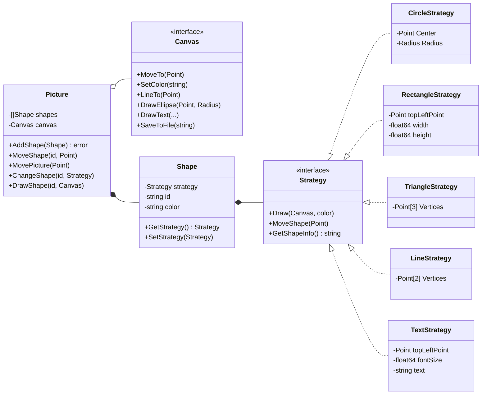

```mermaid
classDiagram
direction LR

    class Strategy{
        <<interface>>
        +Draw(Canvas, color)
        +MoveShape(Point)
        +GetShapeInfo() string
    }
    class Canvas{
        <<interface>>
        +MoveTo(Point)
        +SetColor(string)
        +LineTo(Point)
        +DrawEllipse(Point, Radius)
        +DrawText(...)
        +SaveToFile(string)
    }

    class Picture {
        -[]Shape shapes
        -Canvas canvas
        +AddShape(Shape) error
        +MoveShape(id, Point)
        +MovePicture(Point)
        +ChangeShape(id, Strategy)
        +DrawShape(id, Canvas)
    }
    class Shape {
        -Strategy strategy
        -string id
        -string color
        +GetStrategy() Strategy
        +SetStrategy(Strategy)
    }

    class CircleStrategy {
        -Point Center
        -Radius Radius
    }
    class RectangleStrategy {
        -Point topLeftPoint
        -float64 width
        -float64 height
    }
    class TriangleStrategy {
        -Point[3] Vertices
    }
    class LineStrategy {
        -Point[2] Vertices
    }
    class TextStrategy {
        -Point topLeftPoint
        -float64 fontSize
        -string text
    }

    Strategy <|.. CircleStrategy
    Strategy <|.. RectangleStrategy
    Strategy <|.. TriangleStrategy
    Strategy <|.. LineStrategy
    Strategy <|.. TextStrategy

    Picture o-- Canvas
    Picture *-- Shape
    Shape *--  Strategy
```