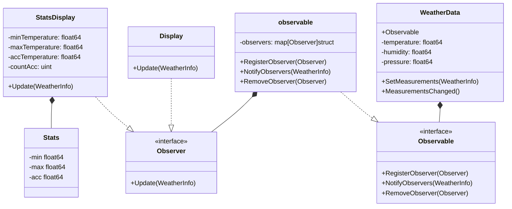

```mermaid
classDiagram
    class Observer {
        <<interface>>
        +Update(WeatherInfo)
    }

    class Display {
        +Update(WeatherInfo)
    }

    class StatsDisplay {
        -minTemperature: float64
        -maxTemperature: float64
        -accTemperature: float64
        -countAcc: uint
        +Update(WeatherInfo)
    }

    class Observable {
        <<interface>>
        +RegisterObserver(Observer)
        +NotifyObservers(WeatherInfo)
        +RemoveObserver(Observer)
    }

    class observable {
        -observers: map[Observer]struct
        +RegisterObserver(Observer)
        +NotifyObservers(WeatherInfo)
        +RemoveObserver(Observer)
    }

    class WeatherData {
        +Observable
        -temperature: float64
        -humidity: float64
        -pressure: float64
        +SetMeasurements(WeatherInfo)
        +MeasurementsChanged()
    }

    class Stats {
        -min float64
        -max float64
        -acc float64
    }

    observable ..|> Observable
    Display ..|> Observer
    StatsDisplay ..|> Observer
    StatsDisplay *-- Stats
    WeatherData *-- Observable
    observable *-- Observer
```