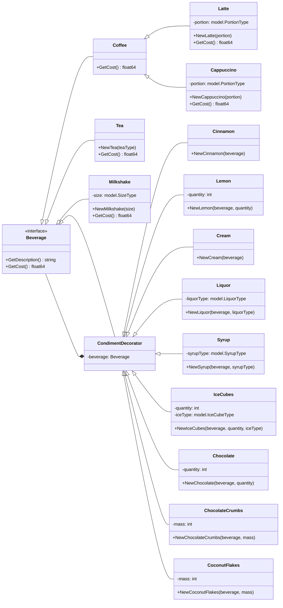

```mermaid
classDiagram
    direction RL

    class Beverage {
        <<interface>>
        +GetDescription() string
        +GetCost() float64
    }

    class Coffee {
        +GetCost() float64
    }

    class Latte {
        -portion: model.PortionType
        +NewLatte(portion)
        +GetCost() float64
    }

    class Cappuccino {
        -portion: model.PortionType
        +NewCappuccino(portion)
        +GetCost() float64
    }

    class Tea {
        +NewTea(teaType)
        +GetCost() float64
    }

    class Milkshake {
        -size: model.SizeType
        +NewMilkshake(size)
        +GetCost() float64
    }


    class CondimentDecorator {
        -beverage: Beverage
    }

    class Lemon {
        -quantity: int
        +NewLemon(beverage, quantity)
    }

    class Cinnamon {
        +NewCinnamon(beverage)
    }

    class Cream {
        +NewCream(beverage)
    }

    class Liquor {
        -liquorType: model.LiquorType
        +NewLiquor(beverage, liquorType)
    }

    class Syrup {
        -syrupType: model.SyrupType
        +NewSyrup(beverage, syrupType)
    }

    class IceCubes {
        -quantity: int
        -iceType: model.IceCubeType
        +NewIceCubes(beverage, quantity, iceType)
    }

    class Chocolate {
        -quantity: int
        +NewChocolate(beverage, quantity)
    }

    class ChocolateCrumbs {
        -mass: int
        +NewChocolateCrumbs(beverage, mass)
    }

    class CoconutFlakes {
        -mass: int
        +NewCoconutFlakes(beverage, mass)
    }
    
    Coffee --|> Beverage
    Latte --|> Coffee
    Cappuccino --|> Coffee
    Tea --|> Beverage
    Milkshake --|> Beverage
    CondimentDecorator --|> Beverage
    CondimentDecorator *-- Beverage
    Cinnamon --|> CondimentDecorator
    Lemon --|> CondimentDecorator
    Cream --|> CondimentDecorator
    Liquor --|> CondimentDecorator
    Syrup --|> CondimentDecorator
    IceCubes --|> CondimentDecorator
    Chocolate --|> CondimentDecorator
    ChocolateCrumbs --|> CondimentDecorator
    CoconutFlakes --|> CondimentDecorator
```