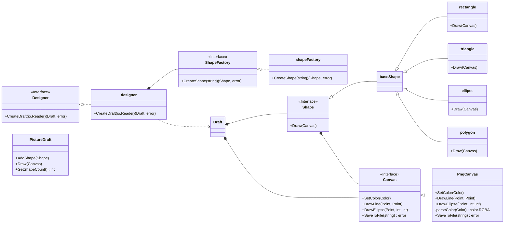

```mermaid
classDiagram
    direction LR

    class Designer {
        <<Interface>>
        +CreateDraft(io.Reader) (Draft, error)
    }

    class designer {
        +CreateDraft(io.Reader) (Draft, error)
    }

    class ShapeFactory {
        <<Interface>>
        +CreateShape(string) (Shape, error)
    }

    class shapeFactory {
        +CreateShape(string) (Shape, error)
    }
    
    class PictureDraft {
        +AddShape(Shape)
        +Draw(Canvas)
        +GetShapeCount() int
    }
    
    class Shape {
        <<Interface>>
        +Draw(Canvas)
    }

    class baseShape

    class rectangle {
        +Draw(Canvas)
    }
    class triangle {
        +Draw(Canvas)
    }
    class ellipse {
        +Draw(Canvas)
    }
    class polygon {
        +Draw(Canvas)
    }

    class Canvas {
        <<Interface>>
        +SetColor(Color)
        +DrawLine(Point, Point)
        +DrawEllipse(Point, int, int)
        +SaveToFile(string) error
    }

    class PngCanvas {
        +SetColor(Color)
        +DrawLine(Point, Point)
        +DrawEllipse(Point, int, int)
        -parseColor(Color) color.RGBA
        +SaveToFile(string) error
    }

    Designer <|.. designer
    designer *-- ShapeFactory

    ShapeFactory <|.. shapeFactory

    Draft *-- Shape
    designer ..> Draft

    Shape <|-- baseShape
    baseShape <|-- rectangle
    baseShape <|-- triangle
    baseShape <|-- ellipse
    baseShape <|-- polygon
    
    Canvas <|.. PngCanvas
    Draft *-- Canvas
    Shape *-- Canvas
```