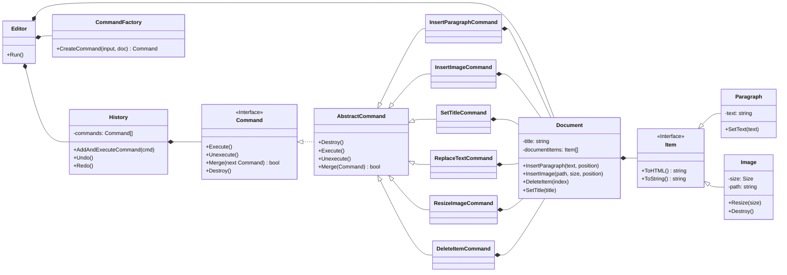

```mermaid
classDiagram
direction LR

    class Editor {
        +Run()
    }

    class History {
        +AddAndExecuteCommand(cmd)
        +Undo()
        +Redo()
        -commands: Command[]
    }

    class Command {
        <<Interface>>
        +Execute()
        +Unexecute()
        +Merge(next Command) bool
        +Destroy()
    }
    
    class AbstractCommand {
        +Destroy()
        +Execute()
        +Unexecute()
        +Merge(Command) bool
    }

    class InsertParagraphCommand
    class InsertImageCommand
    class SetTitleCommand
    class ReplaceTextCommand
    class ResizeImageCommand
    class DeleteItemCommand

    class Document {
        +InsertParagraph(text, position)
        +InsertImage(path, size, position)
        +DeleteItem(index)
        +SetTitle(title)
        -title: string
        -documentItems: Item[]
    }

    class CommandFactory {
        +CreateCommand(input, doc) Command
    }

    class Item {
        <<Interface>>
        +ToHTML() string
        +ToString() string
    }
    
    class Paragraph {
        +SetText(text)
        -text: string
    }
    
    class Image {
        +Resize(size)
        +Destroy()
        -size: Size
        -path: string
    }

    Editor *-- History
    Editor *-- Document
    Editor *-- CommandFactory

    History *-- Command

    Command <|.. AbstractCommand
    
    AbstractCommand <|-- InsertParagraphCommand
    AbstractCommand <|-- InsertImageCommand
    AbstractCommand <|-- SetTitleCommand
    AbstractCommand <|-- ReplaceTextCommand
    AbstractCommand <|-- ResizeImageCommand
    AbstractCommand <|-- DeleteItemCommand
    
    InsertParagraphCommand *-- Document
    InsertImageCommand *-- Document
    SetTitleCommand *-- Document
    ReplaceTextCommand *-- Document
    ResizeImageCommand *-- Document
    DeleteItemCommand *-- Document

    Document *-- Item

    Item <|-- Paragraph
    Item <|-- Image
```