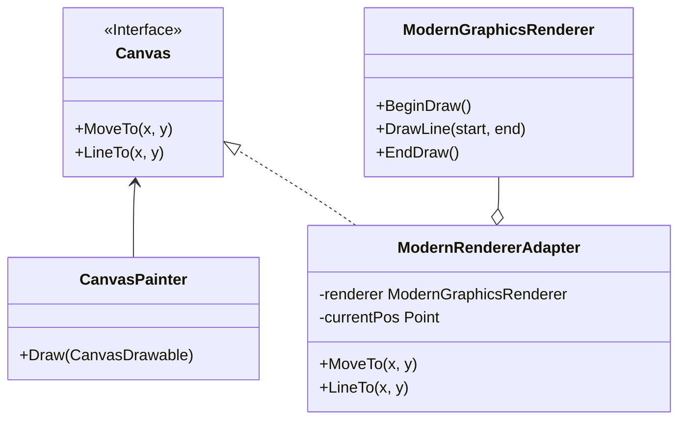

```mermaid
classDiagram
    direction BT

    class CanvasPainter {
        +Draw(CanvasDrawable)
    }

    class Canvas {
        <<Interface>>
        +MoveTo(x, y)
        +LineTo(x, y)
    }

    class ModernGraphicsRenderer {
        +BeginDraw()
        +DrawLine(start, end)
        +EndDraw()
    }

    class ModernRendererAdapter {
        -renderer ModernGraphicsRenderer
        -currentPos Point
        +MoveTo(x, y)
        +LineTo(x, y)
    }

    CanvasPainter --> Canvas
    ModernRendererAdapter ..|> Canvas
    ModernRendererAdapter o-- ModernGraphicsRenderer
```