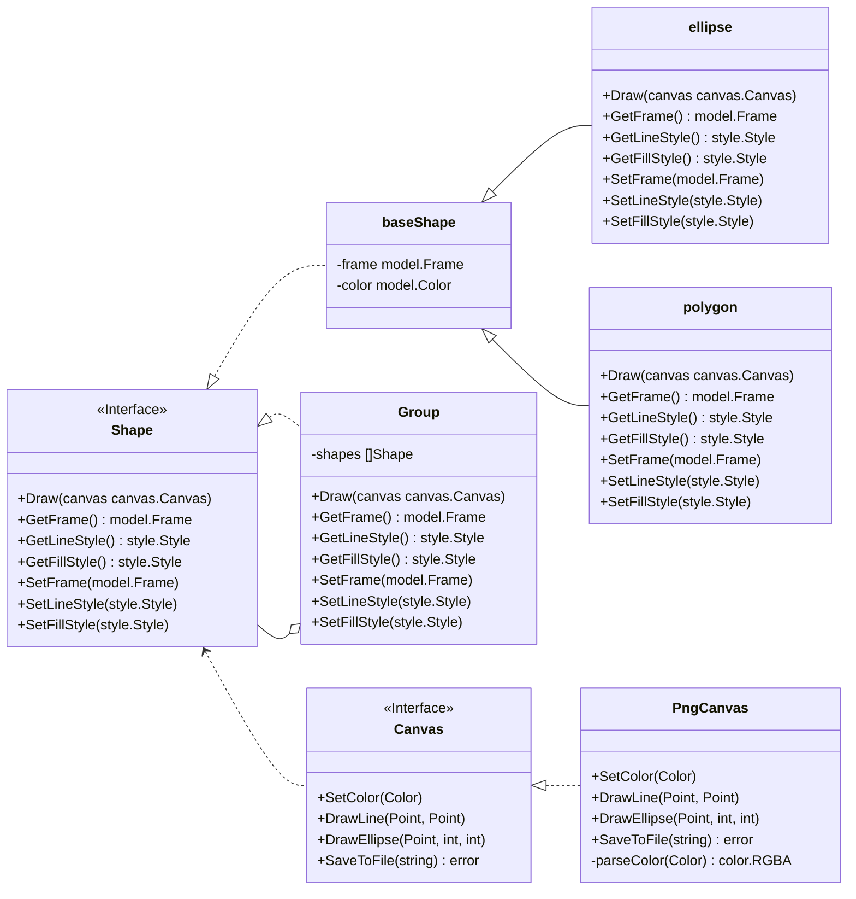

```mermaid
classDiagram
    direction LR
    
    class Shape {
        <<Interface>>
        +Draw(canvas canvas.Canvas)
        +GetFrame() model.Frame
        +GetLineStyle() style.Style
        +GetFillStyle() style.Style
        +SetFrame(model.Frame)
        +SetLineStyle(style.Style)
        +SetFillStyle(style.Style)
    }

    class baseShape {
        -frame model.Frame
        -color model.Color
    }

    class ellipse {
        +Draw(canvas canvas.Canvas)
        +GetFrame() model.Frame
        +GetLineStyle() style.Style
        +GetFillStyle() style.Style
        +SetFrame(model.Frame)
        +SetLineStyle(style.Style)
        +SetFillStyle(style.Style)
    }
    class polygon {
        +Draw(canvas canvas.Canvas)
        +GetFrame() model.Frame
        +GetLineStyle() style.Style
        +GetFillStyle() style.Style
        +SetFrame(model.Frame)
        +SetLineStyle(style.Style)
        +SetFillStyle(style.Style)
    }
    
    class Group {
        +Draw(canvas canvas.Canvas)
        +GetFrame() model.Frame
        +GetLineStyle() style.Style
        +GetFillStyle() style.Style
        +SetFrame(model.Frame)
        +SetLineStyle(style.Style)
        +SetFillStyle(style.Style)
        -shapes []Shape
    }

    class Canvas {
        <<Interface>>
        +SetColor(Color)
        +DrawLine(Point, Point)
        +DrawEllipse(Point, int, int)
        +SaveToFile(string) error
    }

    class PngCanvas {
        +SetColor(Color)
        +DrawLine(Point, Point)
        +DrawEllipse(Point, int, int)
        +SaveToFile(string) error
        -parseColor(Color) color.RGBA
    }

    Shape <|.. baseShape
    baseShape <|-- ellipse
    baseShape <|-- polygon
    
    Shape <|.. Group
    Shape --o Group
    
    Canvas <|.. PngCanvas
    Shape <.. Canvas
```