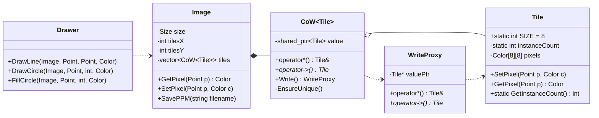

```mermaid
classDiagram
    direction LR
    class Image {
        -Size size
        -int tilesX
        -int tilesY
        -vector~CoW~Tile~~ tiles
        +GetPixel(Point p) Color
        +SetPixel(Point p, Color c)
        +SavePPM(string filename)
    }

    class Tile {
        +static int SIZE = 8
        -static int instanceCount
        -Color[8][8] pixels
        +SetPixel(Point p, Color c)
        +GetPixel(Point p) Color
        +static GetInstanceCount() int
    }

    class CoW~Tile~ {
        -shared_ptr~Tile~ value
        +operator*() Tile&
        +operator->() Tile*
        +Write() WriteProxy
        -EnsureUnique()
    }

    class WriteProxy {
        -Tile* valuePtr
        +operator*() Tile&
        +operator->() Tile*
    }

    class Drawer {
        +DrawLine(Image, Point, Point, Color)
        +DrawCircle(Image, Point, int, Color)
        +FillCircle(Image, Point, int, Color)
    }

    Image *-- CoW~Tile~
    CoW~Tile~ o-- Tile
    CoW~Tile~ ..> WriteProxy
    WriteProxy ..> Tile
    Drawer ..> Image
```